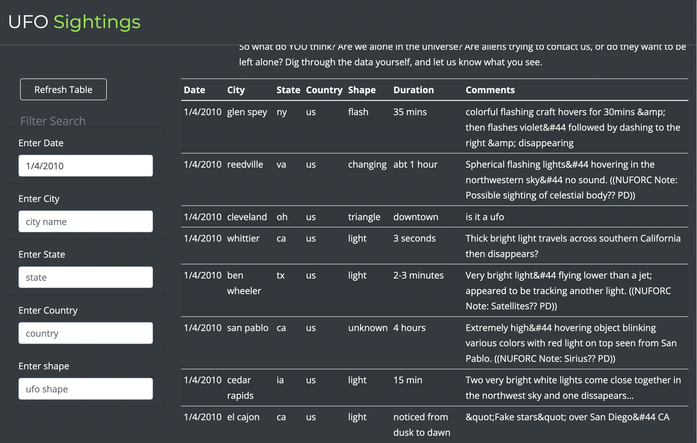
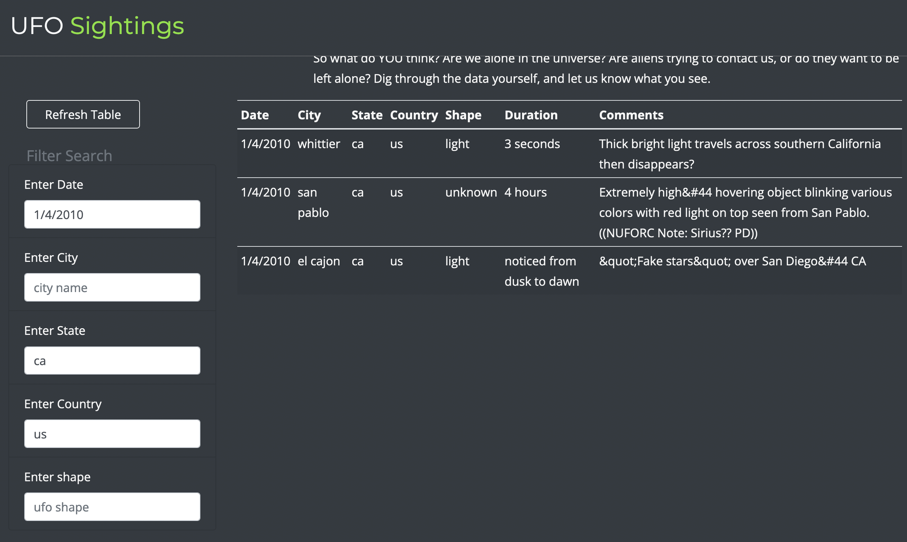
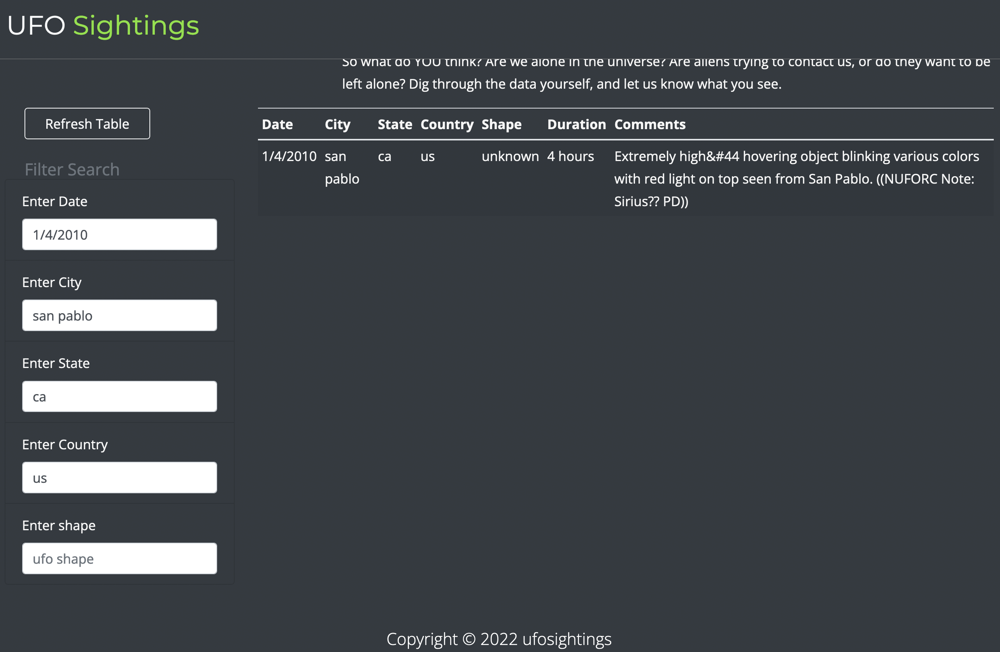

## Overview of Project: 
- The main goal of this analysis is to include multiple criteria to filter the UFO sightings table in order to allow users be able to tailer their search.

## Results: 
- Now the UFO sightings webpage allows you to filter the sightings table using date, city name, state, country and even the shape of the sighting. That is a huge convenience for users. 

- The screen shoots bellow show sample results of using multiple filters:

- **filtered by date**

- **filtered by state and country**

- **filtered by city name**

## Summary:
- The main drawback of this webpage is that, due to the large tabel size, it is not responsive on small screen sizes. Hence, interms of the design, a rework of the layout to make the data mobile friendly would be great. 
- As far as the main data goes it would be nice to include sightings from different countries. How about adding some footages/pics of sightings? 
